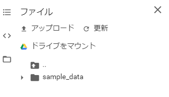
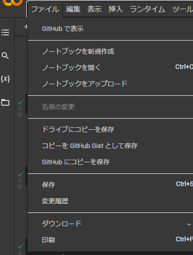

# induction_course

# Introduction
本研修ではgoogle Cokabratoryを使用します。初めにIntroduction.ipynbに記載されているチュートリアルを開始してください。

## google colab状でgithubからcloneする方法
### 手順
Driveマウント→clone<br>
マウントは最初の1回だけでOK。
### 1. Google Driveをマウントする
Google Driveをマウントする
ご存知の通りColabはインスタンスの12時間ルール＆90分ルールがあるので、作業ディレクトリの内容が一定時間で消えてしまいます。
当然.gitなども保存されず、これではコード管理もやりようがないので、まずはGoogle Driveをマウントします。
UI上で左側のファイルボタンを押し、「ドライブをマウント」でマウントできます。

<br>
これで自分のGoogleDrive上のファイルをノートブック上で扱えるようになり、保存もできるようになります。

## GitHubのリポジトリをGoogle Driveにclone

Google ColabのNotebook上でGoogle Driveをマウントする
なんでもいいのでGoogle Colabのノートブックを作成するか、既存のてきとうなノートブックを開きます。
マウントするためだけのノートブックなので、ほんとにてきとうで良いです。

作成したノートブック上で以下のようなコードをし実行ます。
```
from google.colab import drive
drive.mount('/content/gdrive')
```
Google ColabのNotebook上でGit Cloneする
基本的にはただGit Cloneするコマンドを実行するだけです。
が、微妙に書き換えないといけないところがあります。
私はこの「微妙に書き換えないといけないとこ」が良くわからずマジで時間を無駄にしました。しにたい。

ポイントとしては以下の通りです。

Git Cloneするリンクに、自分のGitアカウントをGitパスワードを含める
ローカルリポジトルを作るディレクトリはGoogle ColabにマウントしたGoogle Driveを指定
この二つを踏まえたGit Clone用コマンドは以下のような感じです。
```
!git clone  https://<自分のGitアカウント>:<Gitパスワード>@github.com/<Gitアカウント>/<リポジトリ>.git "gdrive/My Drive/<ローカルリポジトリを作るディレクトリ>"
```

以下clone下ディレクトリのノートブックを開いて実行

修正中
```
### 使用するノートブックをアップロードする
使用するノートブックをgithubからアップロードして実行できるようにします。



ノートブックをアップロードを選択します。
以下のような表示が出てくると思いますので、
`Github URLを入力するか、組織またはユーザーで検索します`にhttps://github.com/kokutoubanira/induction_course.git　
を入力しノートブックを選択すれば開始できます。
```

# 1章 pythonの使い方100本ノック
本章では、Pythonの基礎的な文法について学びます。次章以降に登場するコードを理解するにあたって必要となる最低限の知識について最短で習得するのが目標です。より正確かつ詳細な知識を確認したい場合には公式のユーとリアルなどを参照してください。

# 2章 Numpy 50本ノック
最初にPythonにおけるNumPyの役割やNumPyを使ってできることを解説します。
まずはNumPyで何ができるのかを理解しましょう。

# 3章　Pandas 100本ノック
データ処理の基本ツールとしてPandasの使い方を紹介します。Pandasには便利な機能がたくさんありますが、特に分析業務で頻出のPandas関数・メソッドを重点的に取り上げました。
Pandasに便利なメソッドがたくさんあることは知っている、でも知りたいのは分析に最低限必要なやつだけ！、という人のためのPandasマニュアルです。単に機能を説明するだけでは実際の処理動作がわかりにくいため、タイタニックのデータに対してpandasの処理を適応していくことで一連のpandasの操作を体験できる様にしています。

# 4章　自然言語処理 100本ノック
自然言語処理を理解するために必要な最低限の知識と実装の仕方を学びます。自然言語処理には様々なタスクにについても学びます。

# Create Chat bot
ここでは、1~4章で学んだ知識を活用して、チャットボットを作成してみます。4章で学んだ知識を応用すれば様々なものが作成することができます。
